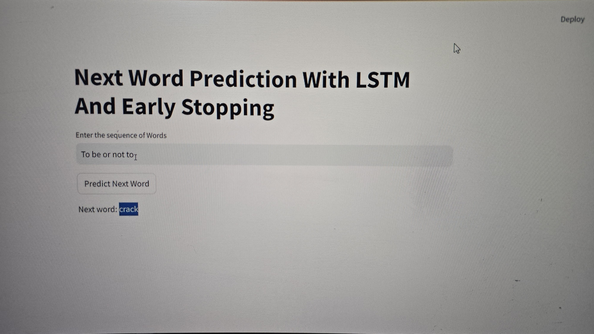

# Next Word Predicition using LSTM.

## Table of Contents

1. [About The Project](#about-the-project)
2. [Built_With](#Built-with)
   - [Prerequisites](#prerequisites)
   - [Installation](#installation)
3. [Usage](#usage)
4. [References](#references)
5. [Contact](#contact)

---

## About The Project

This project implements a next-word prediction model using a _Long Short-Term Memory (LSTM)_ network in Keras/TensorFlow and deploys it as a Streamlit web application. The model is trained on a text corpus (not included in this snippet) and learns the statistical relationships between words to predict the most likely word to follow a given sequence. The training process (also not shown) involves tokenizing the text, creating sequences of words, padding those sequences to a fixed length, and training the LSTM network to predict the next word in the sequence. Early stopping (mentioned in the Streamlit title) is likely used during training to prevent overfitting.

This repository contains the code for the Streamlit app (app.py or similar). It loads a pre-trained LSTM model (next_word_lstm.h5) and a tokenizer (tokenizer.pickle). The tokenizer is used to convert text input into numerical sequences that the model can understand. The core prediction logic is encapsulated in the predict_next_word function. This function takes the model, tokenizer, input text, and maximum sequence length as input. It tokenizes the input text, pads it to the appropriate length, uses the model to predict the probabilities of the next words, and returns the word with the highest probability.

The Streamlit app provides a simple text input box where users can enter a sequence of words. When the "Predict next word" button is clicked, the app calls the predict_next_word function and displays the predicted next word. This allows users to interact with the trained model in a user-friendly way. This project demonstrates a basic but functional example of next-word prediction, showcasing the use of LSTMs for sequence modeling and Streamlit for web deployment. It can be extended with larger datasets, more complex models, and improved user interfaces.

.
---

## Built With

The tools that have been used in the project are:

- **Python**
- **Tensor Flow**
- **Streamlit**
- **LSTM's**

  ### Prerequisites

  - **Python 3.7+** (Recommended: 3.8 or 3.9)
  - **Tensor Flow**
  - **StreamLit**
 
  ### Installation

1. **Download Python Packages**
2. **Packages in Requirements File**

### Usage
1. **Text Generation and Completion**
2. **Auto Completion**

### References
[https://www.analyticsvidhya.com/blog/2021/08/predict-the-next-word-of-your-text-using-long-short-term-memory-lstm/](https://www.analyticsvidhya.com/blog/2021/08/predict-the-next-word-of-your-text-using-long-short-term-memory-lstm/).

### Contact
### _Pramathesh T S_

**Email ID** - pramatheshts025@gmail.com 
**LinkedIn** - [https://www.linkedin.com/in/pramatheshts1999/](https://www.linkedin.com/in/pramatheshts1999/) 
**GitHub**   - [https://github.com/Pramathesh690/](https://github.com/Pramathesh690/)
